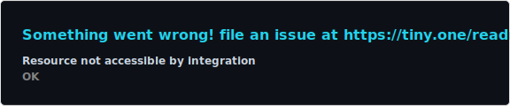

<table width="100%" style="border: none; border-collapse: collapse;">
  <tr style="border: none;">
    <td width="60%" valign="top" style="border: none;">
      
Hi there! 👋 I'm a developer passionate about AI, automation, embedded systems, and full-stack development. 
      Always eager to learn new things and build cool tools.

       
      <b>Focus Areas:</b>
      <ul>
        <li>🤖 <b>AI / RAG:</b> retrieval, vision, notebooks</li>
        <li>⚙️ <b>Automation:</b> game tooling, workflow scripts, desktop helpers</li>
        <li>🔌 <b>Embedded:</b> STM32, C / Verilog, MCU projects</li>
        <li>💻 <b>Apps:</b> Swift, C#, web dashboards</li>
      </ul>
    </td>
    <td width="40%" valign="top" align="center" style="border: none;">
        
        
      
    </td>
  </tr>
</table>

## 💻 Tech Stack

<b>Languages:</b> 

<b>Frameworks:</b> 

<b>Tools:</b> 

 

## 📊 GitHub Activity

  
  

